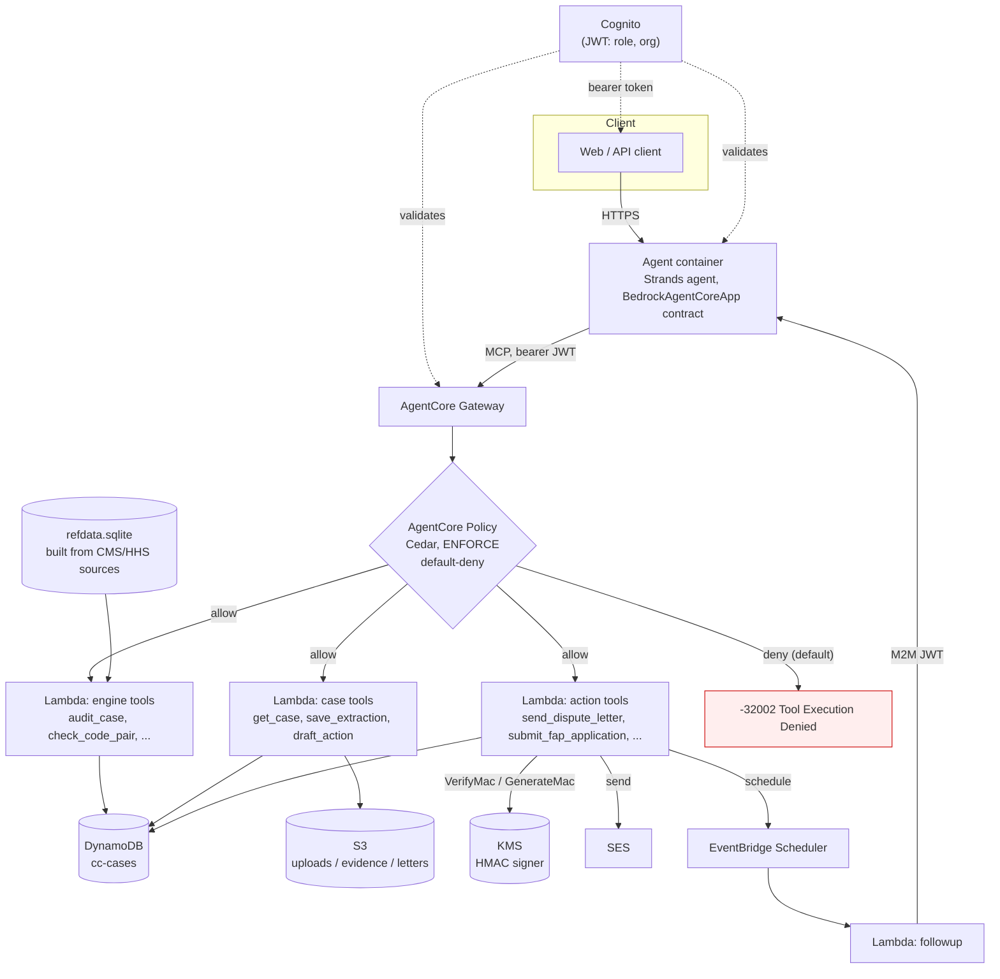

# Countercharge

A patient-advocate agent that audits US hospital bills against Medicare's own public
rulebooks, finds what's overcharged or eligible for charity care, and only acts on the
outside world through three independent, fail-closed gates.

**Demo video:** https://youtu.be/dia0cTQl0Uo · **Live demo:** https://rayyer220.github.io/countercharge/ · [Trust Center](https://rayyer220.github.io/countercharge/trust.html) · [Architecture](docs/ARCHITECTURE.md) · [Claims ledger](docs/CLAIMS.md)

## The problem

100 million Americans carry $220 billion in medical debt ([Consumer Financial Protection
Bureau](https://www.consumerfinance.gov/rules-policy/medical-debt/)). A large share of it
shouldn't exist: nearly 45% of nonprofit hospitals routinely bill patients whose income
already qualifies them for charity care under the hospital's own policy ([KFF Health
News, analysis of hospitals' IRS
filings](https://kffhealthnews.org/health-care-costs/patients-eligible-for-charity-care-instead-get-big-bills/)).
Layer on coding errors, balance billing after emergency care, and self-pay prices above a
hospital's own cash rate, and most bills carry money nobody actually owes.

Finding that money today means a patient or an advocate manually cross-referencing a CPT
code against a 1.7-million-row NCCI edit table, or reading a hospital's charity-care PDF
by hand. Nobody does that at scale. Countercharge does it automatically, and only claims
what it can point to a citation for.

## Who it's for

- **Nonprofit patient advocates** (Dollar For–style organizations, hospital social
  workers, community health workers) running a caseload of patients with medical bills.
- **The patients they serve**, who can run the same audit on their own bill.

## What it does

1. Takes an itemized bill (plus, optionally, an insurance EOB, household income, and a
   good-faith estimate).
2. Runs it through a deterministic engine against CMS/HHS reference data: NCCI
   procedure-to-procedure edits, Medically Unlikely Edits, No Surprises Act balance-billing
   rules, hospital price-transparency files, IRS 501(r) charity-care rules, and an
   advisory Medicare-rate benchmark.
3. Produces findings, each with a rule id, a dollar amount, and a citation back to the
   exact CMS/HHS record it came from.
4. Drafts a dispute letter, a charity-care application, an itemized-bill request, or a
   regulator escalation — grounded only in those findings.
5. Holds every draft for human approval before anything leaves the building.
6. Sends the approved action, schedules a follow-up, and escalates if nothing happens.

## How it works

The engine never talks to a language model, and the language model never talks to the
outside world directly. Every side-effecting action passes through the same three gates,
in order, and every one of them fails closed:

1. **Strands interrupt** — the agent pauses on a `BeforeToolCallEvent` for any
   side-effecting tool and waits for a human approval token; there is no code path that
   calls an action tool without one.
2. **AgentCore Gateway + AgentCore Policy (Cedar, ENFORCE, default-deny)** — every tool
   call is authorized against Cedar policies keyed on the caller's role, the tool's
   inputs, and the resource. No policy matching a request means the request is denied.
3. **Lambda tool target** — re-verifies the approval token (KMS `VerifyMac`), re-hashes
   the exact tool input the token was issued for, re-checks that every cited finding
   exists, is signed, and is disputable, and re-checks the recipient against the
   hospital's allowed billing domain. Any check failing raises, denies, and is logged as
   a decision — nothing is ever silently swallowed.



## The three gates, with example denials

| Layer | What it checks | Example deny | What comes back |
|---|---|---|---|
| Strands interrupt | Is there an approval for this exact action yet? | Agent tries `send_dispute_letter` before a human approved the draft | The tool is never called; the turn ends on an `interrupt` event instead |
| AgentCore Policy (Cedar) | Role, action, and input against the policy set; default-deny | An `integrator` (public MCP) role calls any case/action tool | `{"error":{"code":-32002,"message":"Tool Execution Denied ... denied by default"}}` |
| Lambda tool target | Approval token MAC, expiry, and exact input hash; finding signatures; recipient domain | Agent (or an attacker) resends `send_dispute_letter` with the disputed amount changed after approval | `DENIED:lambda:input_mismatch`, logged as a decision |

Other Lambda-layer denials covered by tests: `bad_mac`, `expired`, `tool_mismatch`,
`action_mismatch`, `case_mismatch`, `empty_finding_ids`, `foreign_finding`,
`bad_finding_signature`, `not_disputable`, `amount_exceeds_findings`,
`recipient_not_allowed`.

## Proof

Every number below was measured, not estimated — `uv run pytest -q` in each package
directory, run on 2026-09-15:

| Package | Result |
|---|---|
| `engine/` | 121 passed, 1 skipped |
| `core/` | 82 passed |
| `tools/` | 71 passed |
| `policies/` | 90 passed |
| `agent/` | 61 passed |
| `evals/` | 2 passed, 2 skipped |
| **Total** | **427 passed** |

The engine also runs against a pre-registered synthetic corpus (`evals/`), 45 cases
covering all 9 rules, 8 clean negative controls, and 6 adversarial cases:

- 45/45 cases match the pre-registered rule set exactly
- 100% exact disputable-cents match
- 100% FAP (charity-care) tier accuracy
- **0** false positives on the 8 clean controls
- Per-rule precision and recall: 100%/100% across all nine rules

Full scorecard: [`evals/results/engine-scorecard.md`](evals/results/engine-scorecard.md).
See [`docs/CLAIMS.md`](docs/CLAIMS.md) for exactly which claims are reproducible by
anyone, which need a live AWS deployment, and which are modeled/simulated for the demo.

## Honest limits

- **US only.** The engine only knows US CMS/HHS rules.
- **CPT descriptors are not displayed.** CPT is AMA-licensed; we show the code itself,
  the public HCPCS Level II description where one exists, and our own plain-language
  category label — never the AMA's copyrighted descriptor text.
- **Not legal or medical advice.** Findings cite a rule and a source record; a human
  advocate or the patient decides what to do with them.
- **Demo letters go to a demo inbox**, not the real hospital — every action Lambda sends
  to `demo_billing_email` in [`engine/data/hospitals.json`](engine/data/hospitals.json),
  a mailbox we control, never a live billing department.
- **Patients are synthetic.** The eval corpus is generated, not real patient data.
- **AgentCore Runtime/Memory/Browser/Code-Interpreter quotas are 0 on our AWS account**
  (support-only increase, not yet granted) and Bedrock invoke is blocked account-wide.
  The agent container still implements the AgentCore Runtime contract
  (`BedrockAgentCoreApp`, `/invocations`, SSE) but currently runs on plain infrastructure
  instead of inside the Runtime service. **Gateway, Policy, and Identity are real
  AgentCore** — those services have no quota restriction on this account and are used
  as designed.
- **Inpatient claims are not modeled.** The engine handles ER, outpatient, and
  professional settings; inpatient DRG billing is out of scope.
- **NYP's charity-care income thresholds are UNKNOWN in machine-readable form.** Their
  financial-assistance policy is served behind client-side JavaScript with no plain-text
  thresholds published; rather than guess, `hospital_fap` carries `null` for NYP's
  `free_max_fpl`/`discount_max_fpl` and the engine reports FAP eligibility as unknown for
  that hospital instead of fabricating a number.
- **Gmail intake (read a forwarded EOB from the patient's own inbox) is a stubbed
  interface, not implemented.** All demo mail goes through SES.

## Repo layout

```
engine/      pure-Python deterministic audit engine + CMS/HHS refdata builder
core/        shared types used by tools and the agent (store, signing, approval tokens, settings)
tools/       Lambda handlers = AgentCore Gateway targets (engine / case / actions)
policies/    Cedar policy templates + renderer + tests
agent/       Strands case agent (AgentCore Runtime contract), model provider, gateway client
evals/       synthetic bill/EOB corpus generator, pre-registered answer key, engine scorecard
agentcore/   agentcore CLI project scaffold + CDK (gateway/policy/runtime config)
docs/        architecture, claims ledger
```

## Quick start

Requires Python 3.12+ and [uv](https://docs.astral.sh/uv/).

### Audit a bill with the engine CLI

```bash
cd engine
uv run python -m countercharge_engine audit \
  --bill path/to/bill.json \
  --refdata data/refdata.sqlite
```

`data/refdata.sqlite` ships in the repo, built from the CMS/HHS sources listed in
[`engine/data/REFDATA.md`](engine/data/REFDATA.md). The 45-case synthetic corpus under
`evals/corpus/cases/` bundles a `bill` (plus `eob`/`household`/`gfe` where relevant) per
case; pull the `bill` object out of any case file to try one, or run the whole corpus at
once:

```bash
cd evals
uv run python -m countercharge_evals.run_engine   # writes evals/results/engine-scorecard.*
```

### Run the tests

```bash
cd engine   && uv run pytest -q
cd core     && uv run pytest -q
cd tools    && uv run pytest -q
cd policies && uv run pytest -q
cd agent    && uv run pytest -q
cd evals    && uv run pytest -q
```

### Run the agent locally

```bash
cd agent
cp ../.env.example .env   # fill in at least MODEL_PROVIDER + that provider's API key
uv run python -m countercharge_agent.app
```

`MODEL_PROVIDER` selects the language model backend at runtime — `venice`, `openrouter`,
or `bedrock` — all through the same Strands agent code, no branching in application
logic. The agent still needs `GATEWAY_URL` and `COGNITO_POOL_ID` to reach a deployed
AgentCore Gateway; without AWS credentials it will start but can't call any tools.

## Environment variables

| Variable | Used by | Purpose |
|---|---|---|
| `MODEL_PROVIDER` | agent | `venice` \| `openrouter` \| `bedrock` — selects the language model backend |
| `VENICE_API_KEY` | agent | API key when `MODEL_PROVIDER=venice` |
| `VENICE_MODEL` / `VENICE_MODEL_VISION` | agent | Override the default Venice model id per role |
| `OPENROUTER_API_KEY` | agent | API key when `MODEL_PROVIDER=openrouter` |
| `OPENROUTER_MODEL` | agent | Override the default OpenRouter model id |
| `BEDROCK_MODEL` | agent | Override the default Bedrock model id when `MODEL_PROVIDER=bedrock` |
| `GATEWAY_URL` | agent | AgentCore Gateway MCP endpoint |
| `COGNITO_POOL_ID` | agent | Cognito user pool backing inbound JWTs |
| `COGNITO_REGION` | agent | Defaults to `REGION` |
| `COGNITO_ALLOWED_CLIENT_IDS` | agent | Comma-separated allowed app client ids |
| `SESSION_BUCKET` | agent | S3 bucket for session state; defaults to `BUCKET` |
| `BROWSER_MODE` | agent | `local` (Playwright in-container) \| `agentcore` (AgentCore Browser) |
| `TABLE_NAME` | tools, agent | DynamoDB table name (default `cc-cases`) |
| `BUCKET` | tools, agent | S3 bucket for uploads/evidence/letters |
| `KMS_KEY_ID` | tools, agent | KMS HMAC key id for signing findings and approval tokens |
| `LOCAL_HMAC_SECRET` | tools, agent | Local/dev HMAC secret used when `KMS_KEY_ID` is unset |
| `REGION` | tools, agent | AWS region (default `us-east-1`) |
| `SES_SENDER` | tools | Verified SES sender address |
| `HOSPITALS_PATH` | tools, agent | Path to the hospitals registry JSON |
| `REFDATA_PATH` | tools | Local path to `refdata.sqlite` (one of this or `REFDATA_S3_URI` required) |
| `REFDATA_S3_URI` | tools | S3 URI to `refdata.sqlite`, downloaded once per warm container |
| `CC_TARGET` | tools | `engine` \| `case` \| `actions` — selects the Lambda's dispatch table |
| `FOLLOWUP_LAMBDA_ARN` | tools | Target for `schedule_followup`'s EventBridge Scheduler schedule |
| `SCHEDULER_ROLE_ARN` | tools | Execution role EventBridge Scheduler assumes |
| `SCHEDULER_GROUP` | tools | Scheduler group name (default `cc-followups`) |
| `DEMO_TIME_COMPRESSION_SECONDS` | tools | If set, compresses `schedule_followup`'s days into seconds, for demos |
| `CC_MEMORY_EMAIL` | tools | Test/demo escape hatch: swap SES for an in-memory email sender |
| `SYSTEM_CLIENT_SECRET_ID` | tools (`followup`) | Secrets Manager id for the M2M Cognito client |
| `AGENT_INVOKE_URL` | tools (`followup`) | Base URL of the running agent, for the follow-up's re-invocation |

See [`.env.example`](.env.example) for the full list with no values filled in.

## License

MIT — see [`LICENSE`](LICENSE).
